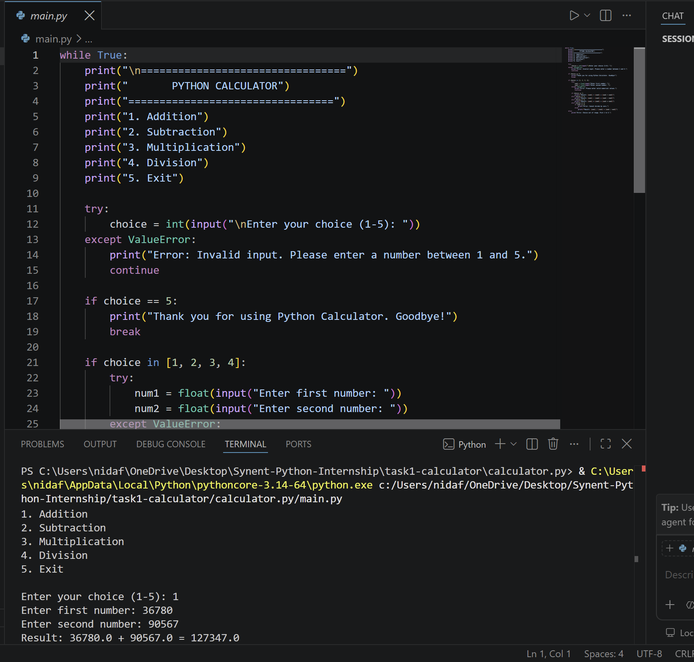

# Synent Task 1: Simple CLI Calculator

A professional command-line interface (CLI) calculator built with Python for the Synent Technologies Internship Program.

## 📌 Project Overview
This application provides a user-friendly terminal interface for basic arithmetic calculations. It includes input validation, graceful error handling for invalid operations (e.g., division by zero, non-numeric inputs), and supports continuous calculations within a loop.

## 🛠️ Methodology & Logic
- **Architecture:** Structured around an interactive `while True` loop presenting a menu-driven interface to process continuous arithmetic requests.
- **Input Validation:** Employs `try-except` blocks handling `ValueError` exceptions to gracefully catch non-numeric inputs without crashing the application.
- **Operational Logic:** Uses clean conditional control structures (`if-elif-else`) to parse option choices and execute specified operations.
- **Edge Case Safety:** Evaluates division inputs prior to calculation to prevent zero-division errors (`ZeroDivisionError`).

## ✨ Key Features
- **Core Operations:** Full support for Addition, Subtraction, Multiplication, and Division.
- **Data Types:** Handles both whole integers and decimal floating-point numbers seamlessly.
- **Fault Tolerance:** Traps invalid text inputs and guards against division by zero.
- **Interactive CLI Loop:** Keeps the user session alive until explicit exit selection (Option 5).

## 📷 Screenshots & Execution Walkthrough

### 1. Source Code & Addition Operation


### 2. Division Handling


### 3. Graceful Exit


## 💻 Example Output
```text
=================================
       PYTHON CALCULATOR
=================================
1. Addition
2. Subtraction
3. Multiplication
4. Division
5. Exit

Enter your choice (1-5): 1
Enter first number: 25.5
Enter second number: 14.5
Result: 25.5 + 14.5 = 40.0

